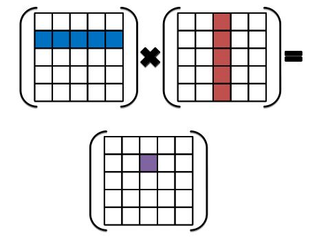

```{r setup, include=FALSE}
source(file.path("..", "R", "util.R"))

required_packages <- c("Rcpp", "RcppEigen")
install_and_load_packages(required_packages)
```

# Exercise 2: Coding on the edge &mdash; being responsible for your own safety in the C++ world

## Part A: Buggy inner product

Below is a (buggy) Rcpp implementation of an inner product calculation. 

```{r, comment='', echo=FALSE}
cat(readLines(file.path("src", "inner_prod.cpp")), sep = '\n')
```

Ignoring the bug for the moment, run the code below and see what you get.

```{r, warning=FALSE}
Rcpp::sourceCpp(file.path("src", "inner_prod.cpp"))

vec_size <- 1023L
v <- rep(1, vec_size)
w <- rep(1, vec_size)
inner_prod(v, w)
```

Still ignoring the bug, run the code below that calculates the same inner product many times and checks whether the output remains the same.
I mean, whether there is a bug or not, an output of a deterministic calculation should surely be the same each time?
Try running the code chunk multiple times. 

```{r, error=TRUE}
first_val <- inner_prod(v, w)

for (i in 1:10^6) {
  v <- rep(1, vec_size)
  w <- rep(1, vec_size)
  subseq_val <- inner_prod(v, w)
  if (!identical(first_val, subseq_val, num.eq = TRUE)) {
    print(subseq_val)
    stop("The last inner prod result disagrees with the previous ones.")
  }
}
```

**Questions:**
What is the behavior you observe above? How do you explain it?

**Response:** Not only is the inner product not correct, the supposedly deterministic calculation in fact does not always produce an identical value. In fact, the calculation produces what appears to be random outputs, many of them of incredibly large magnitude. This is likely due to the fact that the buggy code sums from the first index to the length of the vector. This works in R's default 1-based indexing, but not RCPP's 0-based indexing. This right-shift of 1 entry results in summation of the product of whatever values are sitting directly after the input arrays in memory. As the arrays are allocated for each loop, these values change each time as observed.

## Part B: Sloppy matrix-matrix multiplication

You have been told by the instructor that error-checking is particularly important in C++ and, in particular, that you should probably check for the dimension compatibility before you multiply two matrices in Rcpp(Eigen).
But it would be fair enough to wonder: is that dude really worth listening to?
I'll leave that for you to judge, but for this part of exercise let's consider what might happen if we remove such a safeguard from an Rcpp matrix-matrix multiplication.
Below is an implementation without the dimension check: 

```{r, comment='', echo=FALSE}
cat(readLines(file.path("src", "gemm_eigen_unprotected.cpp")), sep = '\n')
```

Run the code below using the above "unprotected" matrix-matrix multiplication.

```{r, warning=FALSE}
Rcpp::sourceCpp(file.path("src", "gemm_eigen_unprotected.cpp"))

A <- matrix(1, nrow = 4, ncol = 1024)
B <- matrix(1, nrow = 512, ncol = 2)

dgemm_eigen(A, B)
```

**Questions:**
What do you get as an output? What if you re-run the code chunk? Explain the observed behavior.

**Response:**
The result in each case is a $4 \times 2$ matrix, with the first column always uniformly having the value of 1024 and the second column having varying values, with many having quite large magnitudes and NaN's often appearing. This is likely due to how matrices are stored in memory here, by columns. In particular, one finds that the 2 columns of $B$ are stored next to one another in memory, likely being read as a single logical "column" when performing the left-multiplication by $A$. This means that, in calculating the first column of the output matrix, each 1024-dimensional row of $A$ is effectively being multiplied by both columns of $B$ concatenated into a single 1024-dimensional entity. As all entries in $A$ and $B$ are 1, this results in the observed values of 1024 in all entries of the first column of the output. However, for the second column, the calculation is not "saved" by this row concatenation. To form this portion of the output, the C++ library performs the inner product of each row of $A$ with the 512-dimensional columns of $B$ along with the subsequent 512 spaces in memory evaluated as numerics. These values can truly be anything within the full range of double precision, as there could be anything stored in that stretch of memory. It is this fact, in conjunction with movement of where $A$ and $B$ are allocated in memory with each subsequent iteration, that causes the second column of the output to have such random and eratic values.

## Part C: Consequence of "tresspassing"

The code below uses the `axpy_c()` function as seen in lecture.
Run it and see what happens. 
(I am not sure if the behavior is reproducible 100% of time; if you don't observe anything striking, restart the R session and run the code chunk in a fresh state.)

```{r, eval=FALSE}
Rcpp::sourceCpp(file.path("src", "axpy_c.cpp"), rebuild = TRUE)

a <- 3.14
x <- rep(1, 1e7L)
y <- rep(0.00159, 1e3L)

axpy_c(a, x, y)
```

Now try running the code below; it should execute just fine unlike the above one.

```{r, eval=FALSE}
a <- 3.14
x <- rep(1, 1e3L)
y <- rep(0.00159, 1e7L)

axpy_c(a, x, y)
```

**Questions/To-do's:**

* What happens when you run the first code chunk above and why? 
Running the same piece of code from an R console (instead of an RStudio session) should give you more information on what actually happens.
* Why does the second code chunk run fine?
* Modify `axpy_c.cpp` to make the function safer to use.

**Response:**
When running the first code chunk, the session crashes upon running the axpy_c() function, whereas the second chunk produces a defined output. The first chunk, due to the implementation of axpy_c() and the $x$ input being longer than the $y$ input, results in the function attempting to overwrite memory adjacent to the $y$ input vector. For these tests, this results in attempting to overwrite an address vital to functioning of R, causing a segfault due to invalid write permissions. Even if this type of catastrophic failure does not occur though, this type of inadvertent buffer overrun can result in unknowingly changing data in memory, potentially leading to errors in later calculations. The second chunk only does not cause an error due to the fact that $y$ is longer than $x$ and the iteration loop within axpy_c() is based upon the length of $x$. In particular, the code in the second chunk above results in only the first 1000 entries of $y$ being incremented by $3.14 \times 1$ (in-place). This does not overrun the buffer, so no inadvertent overwriting occurs (but the result is still likely not what is expected). In particular, one expects a vector-scalar product such as this to operate only on vectors of the same length, which can be enforced by appending a check for this (check whether x.size() != y.size()) to the beginning of the function.


# Exercise 3: Multiplying two matrices ain't quite what you learned in your linear algebra class

## Part A: Paying homage to your linear algebra teacher

As we all learned in our linear algebra class, the matrix product $\boldsymbol{C} = \boldsymbol{A} \boldsymbol{B}$ of $\boldsymbol{A} \in \mathbb{R}^{n \times k}$ and $\boldsymbol{B} \in \mathbb{R}^{k \times p}$ has its elements defined as
$$C_{ij} = \sum_{\ell = 1}^k A_{i\ell} B_{\ell j}.$$
So a conceptually natural way to implement a matrix multiplication is looping through each row of $\boldsymbol{A}$ and column of $\boldsymbol{B}$, taking inner products of the pairs of vectors:

{width=30%}

Implement a matrix-matrix multiplication based on this approach as `row_col_dot_matmat` using the starter code provided in the `matmat.cpp` file.
Then check that its output agrees with the base R matrix multiplication.

```{r, warning=FALSE}
Rcpp::sourceCpp(file.path("src", "matmat.cpp"))
```

```{r}
n_row_out <- 1024L
n_inner <- 2048L
n_col_out <- 512L
A <- matrix(rnorm(n_row_out * n_inner), nrow = n_row_out, ncol = n_inner)
B <- matrix(rnorm(n_inner * n_col_out), nrow = n_inner, ncol = n_col_out)
```

```{r}
# Check the output of `row_col_dot_matmat`
row_col_out = row_col_dot_matmat(A, B)
base_out = A %*% B

are_all_close(row_col_out, base_out)
```

## Part B: Going one step beyond your linear algebra class

We now consider an alternative approach to matrix-matrix multiplications, noting that we can think of a matrix product $\boldsymbol{A} \cdot \boldsymbol{B}$ as each column of $\boldsymbol{B}$ multiplied by $\boldsymbol{A}$:
$$\boldsymbol{A} \cdot \boldsymbol{B} = \big[ \, \boldsymbol{A} \boldsymbol{b}_1 \, | \, \ldots \, | \, \boldsymbol{A} \boldsymbol{b}_p \, \big].$$
Recalling from lecture that "column-oriented" matrix-vector multiplication is more efficient than "row-oriented" one for R matrices, implement `col_oriented_matmat` (in `matmat.cpp`) that loops through each column of $\boldsymbol{B}$ applying the column-oriented matrix-vector multiplication.
Then compare performances of `row_col_dot_matmat` and `col_oriented_matmat` (but only after you test your column-oriented implementation).
Which one is faster and why?

```{r}
# Check
col_oriented_out = col_oriented_matmat(A, B)
are_all_close(col_oriented_out, base_out)

# Benchmark
bench::mark(row_col_dot_matmat(A, B))
bench::mark(col_oriented_matmat(A, B))
```

**Response:**
As expected, the column-oriented matrix multiplication is faster, on the order of 6-times faster in fact. This is due to the fact that matrices are stored in column-major order in memory for Rcpp/R, such that column-oriented matrix multiplication has much greater likelihood of the requisite sequential data being in cache when compared to standard row-column matrix multiplication. It is this difference in cache misses which produces the observed differences in time taken. 

Also compare with performance of the matrix-matrix multiplication via `%*%` in R, which uses whatever the BLAS library your R was configured with.
(You can find out which BLAS library R is using via `sessionInfo()` or `extSoftVersion()`.) 

```{r}
bench::mark(A %*% B)
bench::mark(col_oriented_matmat(A, B))
```

**Response:** While the column-oriented Rcpp matrix multiplication method implemented outperformed the standard row-column implementation quite significantly, its performance is very similar to that of the built-in BLAS library, only slightly out-performing it in the benchmark above. The presence of a difference in the performance at all is likely a result of the particular syntax used in my implementation and how that is handled by the compiler.

When benchmarking alternative implementations (or alternative algorithms, more generally), keep in mind that the relative performance depends significantly on the size of a test problem.
It is important, therefore, to benchmark your implementation/algorithm on problems of realistic size. 
See the benchmark results of linear algebra libraries from [the Eigen development team](https://eigen.tuxfamily.org/index.php?title=Benchmark) and the results under "Gcbd benchmark" in [this github repository](https://github.com/andre-wojtowicz/blas-benchmarks), for example.


## Part C: Doing it the right way

Part A & B are meant to get you some practice writing Rcpp code and to illustrate how much an algorithm's performance depends on whether or not it respects an underlying representation of data.
Neither of the approaches we've discussed, however, is the most effective way to multiply two matrices on modern hardware.

Dedicated linear algebra libraries typically deploy _blocking_, dividing the matrices $\boldsymbol{A}$ and $\boldsymbol{B}$ into sub-matrices of appropriate size and carrying out multiplications block-wise.
This approach is designed to minimize the data motion between CPU and RAM by re-using the same pieces of data as much as possible once they travel all the way from RAM to L1 cache.
In practice, we of course shouldn't try to implement, let alone optimize, an operation ourselves when there already are efficient software libraries available.
(But, if you are interested in learning more about how the optimized matrix multiplication works, Sec 1.5.4. of Golub and Van Loan (2013) is a good place to start. Also, I found nice lecture slides on this topic [here](https://cs.brown.edu/courses/cs033/lecture/18cacheX.pdf).)

### Rcpp, Eigen, and compiler options
With the interface provided by RcppEigen, the C++ linear algebra library [Eigen](https://eigen.tuxfamily.org/) is one obvious choice for dealing with computationally intensive numerical linear algebra tasks in R.
But the optimized C++ code provided by Eigen is _only one part of the equation_:
in order to achieve the best performance, we have to provide appropriate instructions to the compilers on how to translate the C++ code into machine code specific to each hardware and operating system.
These instructions are given in terms of _compiler flags_. 
I am far from an expert on compiler flags, so the rest of discussion is accurate only to the best of my knowledge 
&mdash; let me know if you find out any part of it to be inaccurate.

Rcpp by default applies the level 2 optimization via flag `-O2` when compiling your Rcpp code.
This flag is a shorthand for turning on a collection of more specific flags and generally leads to efficient machine code without any major drawbacks.
I've been told that the more aggressive level 3 optimization via `-O3` can sometimes hurt performance or even break things.
Which specific flags `-O2` activates to some extent depends on which (version of) compiler you are using;
you can for example see a list of optimizations turned on through the `-O2` flag by the latest GCC version 
[here](https://gcc.gnu.org/onlinedocs/gcc/Optimize-Options.html).
Generally speaking, the level 2 optimization misses some of the important optimization opportunities for scientific computation, such as fused multiply-add (FMA) and AVX's 256-bit vectorized operation discussed in class.
SSE's 128-bit vectorization seems to be activated by `-O2` with Clang 12.0.0, but I am not sure how to confirm it and [their documentation is not particularly helpful](https://clang.llvm.org/docs/CommandGuide/clang.html#cmdoption-o0).

In compiling Rcpp code, you can turn on and off these additional options by modifying the R version of a [Makefile](https://en.wikipedia.org/wiki/Make_(software)#Makefiles) called `Makevars` and `Makevars.win` for Unix and Windows respectively. 
To specify the compiler options for a specific R package, you can place such an Makevars file under the `src/` directory.
To specify the global options that affect all Rcpp code compilations on your computer, you can edit the Makevars file at the location given by `tools::makevars_user()`, which is typically `~/.R/Makevars` in Unix.
For example, to turn on AVX and FMA, you would add a line `CXXFLAGS += -mavx -mfma` in the Makevars file; 
to turn off SSE, you would add `CXXFLAGS += -mno-sse`.
You can read more about the role of Makevars files [here](https://stackoverflow.com/questions/43597632/understanding-the-contents-of-the-makevars-file-in-r-macros-variables-r-ma).

**To-do's:**
Using the `dgemm_eigen()` function from lecture, compare the performances of Eigen's and your custom matrix-matrix multiplication compiled under different optimization options.
Selectively turn on and off SSE, AVX, and FMA to see how each option affects the performances. 
(SSE should be turned on by `-O2` unless explicitly turned off, but if `-mno-sse` makes no performance difference, then try `-msse` or `-msse4`.)
Finally, turn on both AVX and FMA and check the resulting performances.
Report what you find.

```{r, warning=FALSE, eval=FALSE, warning=FALSE}
# Import `dgemm_eigen()` from lecture
Rcpp::sourceCpp(file.path("..", "lecture", "src", "gemm_eigen.cpp"))
```

```{r, eval=FALSE, warning=FALSE}
# Import `dgemm_eigen()` from lecture
Rcpp::sourceCpp(file.path("..", "lecture", "src", "gemm_eigen.cpp"))
Rcpp::sourceCpp(file.path("src", "matmat.cpp"))

n_row_out <- 1024L
n_inner <- 2048L
n_col_out <- 512L
A <- matrix(rnorm(n_row_out * n_inner), nrow = n_row_out, ncol = n_inner)
B <- matrix(rnorm(n_inner * n_col_out), nrow = n_inner, ncol = n_col_out)

# Benchmark
bench::mark(dgemm_eigen(A, B), min_iterations = 250)
bench::mark(col_oriented_matmat(A, B), min_iterations = 250)
```

The results of the benchmark are summarized in the following table.

| Flags   | Eigen Benchmark (Median) | My Function Benchmark (Median) |
|---------|-----------------|-----------------------|
| Default (SSE Enabled) | 258ms | 1.14s |
| SSE Disabled | 693ms  | 1.34s |
| AVX Enabled (+SSE by default)| 167ms | 1.03s |
| FMA Enabled (+SSE by default)|  95.6ms | 1.01s |
| AVX+FMA Enabled (+SSE by default)| 76.2ms | 866s |

First, it should be noted that in every case the optimized Eigen-based matrix multiplication out-performed my column-oriented implementation, nearly always by well over a factor of 2. In the default case, with only SSE enabled such that 128-bit registers are being used, the Eigen-based implementation was around 5 to 6 times faster than my own, handily beating it. However, with SSE turned off, the Eigen implementation falls to just 2 times faster than mine, while my column-oriented function suffered much less relative loss in performance. This is indicative of my implementation not as effectively leveraging these wider 128-bit registers, or any registers wider than the default 64-bit, as is evidenced by the lack of significant reduction in time-taken for my implementation with AVX enabled, which allows for use of 256-bit registers. This is contrasted by a significant speedup for the Eigen-based implementation, which takes a little over half the time with both SSE and AVX enabled as compared to just SSE. For FMA, a similar modest speed-up is seen for my implementation, contrasted with the Eigen-based implementation which achieves performance gains even greater than those it receives from enabling AVX. With both AVX and FMA are enabled, my implementation does complete the computation significantly faster than under any other configuration, but the relative speed-up compared to the other flag settings is still smaller than that achieved by the Eigen-based implementation. So, it is clear from these results that the Eigen-based implementation is not only far more efficient, but it more efficiently leverages these hardware accelerations as well.

